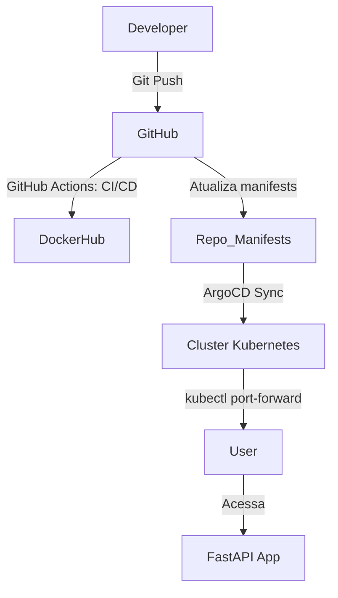
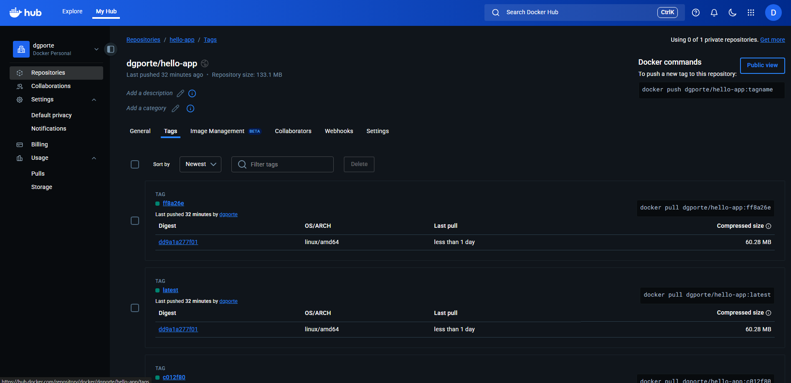
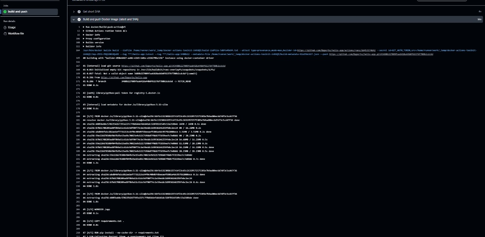
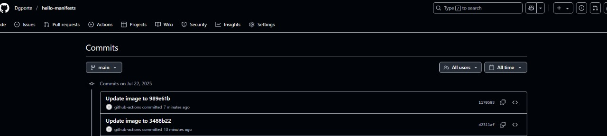
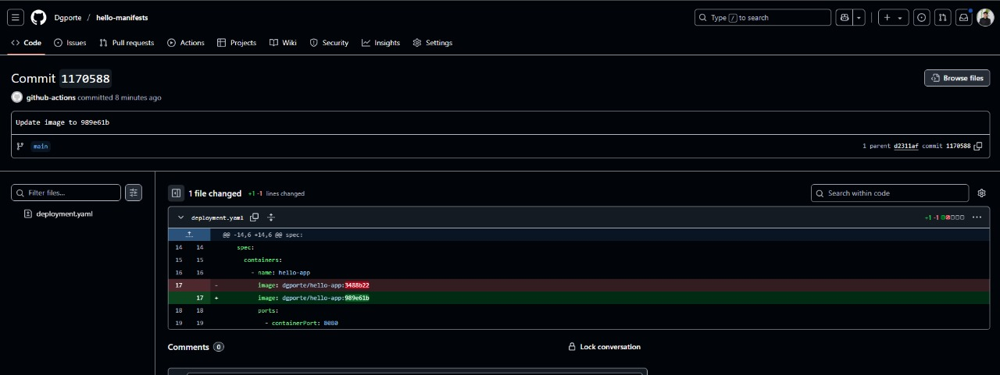
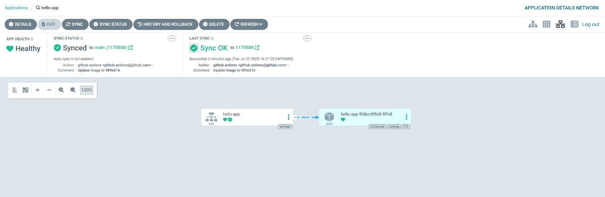
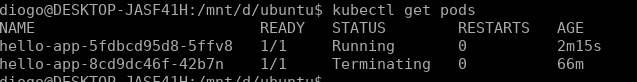
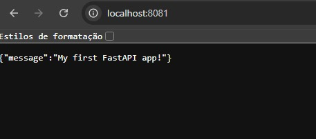

# CI/CD Completo com GitHub Actions, Docker Hub, ArgoCD e Kubernetes Local

Este projeto demonstra um pipeline **CI/CD de ponta a ponta**, integrando as melhores práticas modernas de DevOps para automação total do build, deploy e atualização de uma aplicação FastAPI em Kubernetes local via Rancher Desktop e ArgoCD.
- **Manifests Kubernetes para ArgoCD:** [https://github.com/Dgporte/hello-manifests](https://github.com/Dgporte/hello-manifests)

---

## 🚀 Visão Geral

**Você verá aqui um exemplo real de GitOps, onde todo ciclo de vida da aplicação — do código ao deploy — ocorre de forma automática, auditável e confiável:**

- **Integração Contínua (CI):** Build, tag e publicação de imagem Docker com GitHub Actions a cada commit.
- **Entrega Contínua (CD):** Atualização automática dos manifests Kubernetes e sincronização via ArgoCD.
- **GitOps:** O Git como fonte única de verdade para a infraestrutura e deploy da aplicação.

---

## 📋 Sumário

- [Arquitetura do Projeto](#arquitetura-do-projeto)
- [Checklist de Evidências](#checklist-de-evidências)
- [Pré-requisitos](#pré-requisitos)
- [Passo a Passo Detalhado](#passo-a-passo-detalhado)
  - [1. Criar os Repositórios no GitHub](#1-criar-os-repositórios-no-github)
  - [2. Gerar Token Docker Hub](#2-gerar-token-docker-hub)
  - [3. Gerar Chave SSH para CI/CD](#3-gerar-chave-ssh-para-cicd)
  - [4. Configurar Secrets no GitHub](#4-configurar-secrets-no-github)
  - [5. Criar FastAPI, Dockerfile e requirements](#5-criar-fastapi-dockerfile-e-requirements)
  - [6. Configurar CI/CD com GitHub Actions](#6-configurar-cicd-com-github-actions)
  - [7. Criar Manifests Kubernetes](#7-criar-manifests-kubernetes)
  - [8. Instalar Rancher Desktop e ArgoCD](#8-instalar-rancher-desktop-e-argocd)
  - [9. Configurar App no ArgoCD](#9-configurar-app-no-argocd)
  - [10. Validar Deploy: Prints e Testes](#10-validar-deploy-prints-e-testes)
- [Resumo Visual do Workflow](#resumo-visual-do-workflow)
- [Principais Erros e Soluções](#principais-erros-e-soluções)
- [Referências](#referências)

---

## 🏗️ Arquitetura do Projeto



- **Repositório de Código:** [hello-app](#)
- **Repositório de Manifests:** [hello-manifests](#)
- **Registry:** Docker Hub
- **Orquestração:** Kubernetes local via Rancher Desktop
- **GitOps:** ArgoCD

---

## ✅ Checklist de Evidências

1. **Evidência de build e push da imagem no Docker Hub**
   - Print dos logs do GitHub Actions mostrando o passo de build/push concluído **OU** print da página da imagem no Docker Hub com as tags (`latest` e SHA).

2. **Evidência de atualização automática dos manifests com a nova tag da imagem**
   - Print do log do Actions mostrando o commit/push automático **OU** print do commit no GitHub no repo de manifests mostrando a atualização no `deployment.yaml`.

3. **Captura de tela do ArgoCD com a aplicação sincronizada**
   - Print da tela do ArgoCD mostrando o app como "Synced" e "Healthy".

4. **Print do kubectl get pods com a aplicação rodando**
   - Print do terminal mostrando o pod do hello-app em status `Running`.

5. **Print da resposta da aplicação via curl ou navegador**
   - Print da resposta JSON no terminal (`curl http://localhost:8080/`) **OU** print do navegador acessando [http://localhost:8080/](http://localhost:8080/).

---

## 🛠️ Passo a Passo Detalhado

### 1. Criar os Repositórios no GitHub

- **hello-app:**  
  Repositório da aplicação FastAPI com Dockerfile e workflow GitHub Actions.
- **hello-manifests:**  
  Repositório dos manifests Kubernetes (deployment, service) para GitOps/ArgoCD.

---

### 2. Gerar Token Docker Hub

1. Acesse [https://hub.docker.com/settings/security](https://hub.docker.com/settings/security).
2. Clique em **New Access Token**.
3. Dê um nome (ex: `githubactions`), selecione escopo `Read, Write, Delete`.
4. **Salve o token gerado** (exemplo: `dckr_pat_xxxxx...`).

---

### 3. Gerar Chave SSH para CI/CD

```bash
ssh-keygen -t rsa -b 4096 -C "github-actions" -f ./github-actions
```
- Isso gera `github-actions` (privada) e `github-actions.pub` (pública).
- No repo `hello-manifests` (GitHub > Settings > Deploy keys):  
  Adicione o conteúdo de `github-actions.pub` como **Deploy Key** com permissão de escrita.

---

### 4. Configurar Secrets no GitHub

No repo **hello-app** > Settings > Secrets and variables > Actions:

- **DOCKER_USERNAME:**  
  Seu usuário Docker Hub
- **DOCKER_PASSWORD:**  
  Token gerado no passo 2
- **SSH_PRIVATE_KEY:**  
  Conteúdo do arquivo `github-actions` (privada)

---

### 5. Criar FastAPI, Dockerfile e requirements

**main.py**
```python
from fastapi import FastAPI
app = FastAPI()
@app.get("/")
async def root():
    return {"message": "Hello World"}
```
**requirements.txt**
```
fastapi
uvicorn[standard]
```
**Dockerfile**
```dockerfile
FROM python:3.11-slim
WORKDIR /app
COPY requirements.txt .
RUN pip install --no-cache-dir -r requirements.txt
COPY main.py .
CMD ["uvicorn", "main:app", "--host", "0.0.0.0", "--port", "8080"]
```

---

### 6. Configurar CI/CD com GitHub Actions

No repo **hello-app**, crie `.github/workflows/cicd.yaml`:

```yaml
name: CI/CD

on:
  push:
    branches:
      - main
  workflow_dispatch:

jobs:
  build-and-push:
    runs-on: ubuntu-latest
    steps:
      - uses: actions/checkout@v4
      - name: Set up Docker Buildx
        uses: docker/setup-buildx-action@v3
      - name: Login to DockerHub
        uses: docker/login-action@v3
        with:
          username: ${{ secrets.DOCKER_USERNAME }}
          password: ${{ secrets.DOCKER_PASSWORD }}
      - name: Get short SHA
        id: vars
        run: echo "SHORT_SHA=$(git rev-parse --short HEAD)" >> $GITHUB_ENV
      - name: Build and push Docker image (latest and SHA)
        uses: docker/build-push-action@v5
        with:
          push: true
          tags: |
            ${{ secrets.DOCKER_USERNAME }}/hello-app:latest
            ${{ secrets.DOCKER_USERNAME }}/hello-app:${{ env.SHORT_SHA }}
      - name: Setup SSH
        uses: webfactory/ssh-agent@v0.9.0
        with:
          ssh-private-key: ${{ secrets.SSH_PRIVATE_KEY }}
      - name: Checkout manifests repo
        uses: actions/checkout@v4
        with:
          repository: dgporte/hello-manifests
          ssh-key: ${{ secrets.SSH_PRIVATE_KEY }}
          path: manifests
      - name: Update manifests with new image tag
        run: |
          sed -i "s|image:.*|image: ${{ secrets.DOCKER_USERNAME }}/hello-app:${{ env.SHORT_SHA }}|" manifests/deployment.yaml
      - name: Commit and push manifests
        run: |
          cd manifests
          git config user.name "github-actions"
          git config user.email "github-actions@github.com"
          git add deployment.yaml
          git commit -m "Update image to ${{ env.SHORT_SHA }}"
          git push
```

---

### 7. Criar Manifests Kubernetes

No repo **hello-manifests**:

**deployment.yaml**
```yaml
apiVersion: apps/v1
kind: Deployment
metadata:
  name: hello-app
spec:
  replicas: 1
  selector:
    matchLabels:
      app: hello-app
  template:
    metadata:
      labels:
        app: hello-app
    spec:
      containers:
        - name: hello-app
          image: dgporte/hello-app:latest # será atualizado automaticamente
          ports:
            - containerPort: 8080
```

**service.yaml**
```yaml
apiVersion: v1
kind: Service
metadata:
  name: hello-app
spec:
  selector:
    app: hello-app
  ports:
    - protocol: TCP
      port: 8080
      targetPort: 8080
  type: ClusterIP
```

---

### 8. Instalar Rancher Desktop e ArgoCD

- **Rancher Desktop:**  
  [Download e instalação](https://rancherdesktop.io/)
  - Habilite Kubernetes e aguarde o cluster subir.
- **kubectl:**  
  Verifique:  
  ```bash
  kubectl get nodes
  ```
- **ArgoCD:**  
  [Guia oficial](https://argo-cd.readthedocs.io/en/stable/getting_started/)
  - Instale:  
    ```bash
    kubectl create namespace argocd
    kubectl apply -n argocd -f https://raw.githubusercontent.com/argoproj/argo-cd/stable/manifests/install.yaml
    ```
  - Acesse o server do ArgoCD com port-forward ou NodePort.

---

### 9. Configurar App no ArgoCD

1. Acesse o painel web do ArgoCD.
2. Login com usuário `admin` e senha inicial (`kubectl -n argocd get secret argocd-initial-admin-secret -o jsonpath="{.data.password}" | base64 -d`).
3. Clique em **NEW APP**.
4. Configure:
   - **Application Name:** hello-app
   - **Project:** default
   - **Sync Policy:** Automatic (opcional)
   - **Repository URL:** URL do repo `hello-manifests`
   - **Path:** (raiz ou pasta dos manifests)
   - **Cluster:** Local
   - **Namespace:** default
5. Clique em **Create** e depois **Sync**.

---

### 10. Validar Deploy: Prints e Testes

#### Evidência de build e push da imagem no Docker Hub

- Print do Docker Hub mostrando as tags:
  
- Print do log do GitHub Actions (passo de build e push):
  

#### Evidência de atualização automática dos manifests

- Print do commit automático no repo de manifests:
  

  

#### Captura de tela do ArgoCD com a aplicação sincronizada

- Print do app "hello-app" Synced/Healthy:
  

#### Print do kubectl get pods com a aplicação rodando

```bash
kubectl get pods
```
- 

#### Print da resposta alterada da aplicação via curl ou navegador

```bash
kubectl port-forward svc/hello-app 8080:8080
curl http://localhost:8080/
```
- 

---

## 🚦 Resumo Visual do Workflow

| Etapa                                                                                         | Status    | Tempo | Descrição                                                                                   |
|----------------------------------------------------------------------------------------------|-----------|-------|---------------------------------------------------------------------------------------------|
|  **Checkout** | ✅ Sucesso |  4s   | Baixa o código fonte do repositório principal.                                              |
|  **Setup Docker Buildx** | ✅ Sucesso |  1s   | Prepara o ambiente para builds avançados de imagens Docker.                                 |
|  **Login DockerHub** | ✅ Sucesso | <1s   | Autentica o runner no Docker Hub para push das imagens.                                     |
| 💡 **Get short SHA**                                                                         | ✅ Sucesso | <1s   | Gera a variável de ambiente com o SHA curto do commit.                                      |
|  **Build & Push Docker** | ✅ Sucesso | 15s   | Build e push da imagem FastAPI com as tags `latest` e SHA do commit para o Docker Hub.      |
|  **Setup SSH**              | ✅ Sucesso |  1s   | Adiciona a chave SSH para autenticação no repo de manifests.                                |
|  **Checkout manifests** | ✅ Sucesso |  1s   | Clona o repositório de manifests do Kubernetes.                                             |
| 📝 **Update manifests (`sed`)**                                                               | ✅ Sucesso | <1s   | Atualiza o arquivo `deployment.yaml` com a nova tag da imagem Docker.                       |
|  **Git Commit & Push**  | ✅ Sucesso | <1s   | Faz commit e push automático do manifest alterado para o repo de manifests.                 |

---

<details>
<summary><b>Logs detalhados do último build</b></summary>

- **Check out:** Baixando código fonte.
- **Setup buildx:** Inicializando builder Docker.
- **Login DockerHub:** Login bem-sucedido!
- **Get SHA:** `SHORT_SHA` definido.
- **Build & Push:** Imagem buildada e enviada para Docker Hub (`latest` + SHA).
- **SSH:** Chave adicionada para push seguro.
- **Checkout manifests:** Clonando repo de manifests.
- **Update manifests:** Linha da imagem Docker alterada no YAML.
- **Commit & Push:** Novo commit com a tag atualizada enviado para o repo de manifests.
</details>

---

## 🛠️ Principais Erros e Soluções

### Erro 1: `denied: requested access to the resource is denied`
- **Causa:** Token Docker Hub inválido ou sem permissão.
- **Solução:** Gere um novo token no Docker Hub com permissão de **Write** e atualize nos `secrets` do GitHub.

### Erro 2: `failed to fetch oauth token: ... EOF`
- **Causa:** Instabilidade na rede ou configuração incorreta do secret.
- **Solução:** Aguarde alguns minutos e tente novamente. Verifique se o token está correto no secret.

### Erro 3: `No such image: ...:latest`
- **Causa:** Tentativa de tag/push de uma imagem que não está local após buildx push.
- **Solução:** Use múltiplas tags diretamente no step do build-push-action.

### Erro 4: Push SSH para o repo de manifests falha
- **Causa:** Chave privada SSH inválida ou sem permissão no repo.
- **Solução:** Gere uma nova chave, adicione a pública como deploy key no repo de manifests e a privada como secret.

### Erro 5: ArgoCD não sincroniza
- **Causa:** App mal configurado ou repo inacessível.
- **Solução:** Verifique URL do repo e permissões, sincronize manualmente na interface do ArgoCD.

---

## 📚 Referências

- [Documentação GitHub Actions](https://docs.github.com/actions)
- [Docker Hub Access Tokens](https://docs.docker.com/docker-hub/access-tokens/)
- [ArgoCD getting started](https://argo-cd.readthedocs.io/en/stable/getting_started/)
- [Rancher Desktop](https://docs.rancherdesktop.io/)

---

## 👏 Conclusão

Este repositório demonstra **na prática** como automatizar o ciclo completo de desenvolvimento e entrega de aplicações modernas utilizando CI/CD, Docker, Kubernetes e GitOps.  
Siga o roteiro, adapte para sua realidade, e evolua seu pipeline sempre!

---

**Autor:** [Dgporte](https://github.com/Dgporte)  
**DevOps | Cloud | GitOps | Kubernetes**
